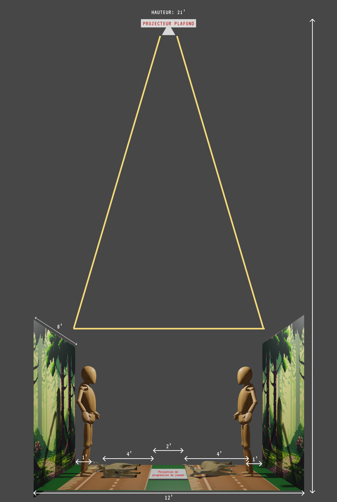

#  On est bien avancé !

## Camille

Cette semaine, j'ai continué à travailler sur le design des réseaux sociaux. J'ai aussi mis à jour notre maquette scénographique pour qu'elle soit à l'échelle et qu'elle ait des dimensions.

Nous avons parlé beaucoup en équipe cette semaine sur exactement comment nous voulons que notre installation soit, pour rendre le tout plus tangible. Nous avons aussi essayé notre projection avec le projecteur pour voir si le ratio et les dimensions sont correctes. 

J'ai aussi commencé à travailler sur le design de la projection.

## Dominik
Cette semaine, j'ai continué à travailler sur le prototype du projet pour le 7 novembre.

La base du jeu étant faite, j'ai commencé à travailler sur plusieurs points plus petits. Par exemple, afficher différents display sur différents écrans, ajouter le joueur 2 faire bouger les routes et ambulances selon la vitesse que le joueur gagne en effectuant le RCR ou encore la condition de victoire qui pour le moment, n'affiche qu'un panneau.

