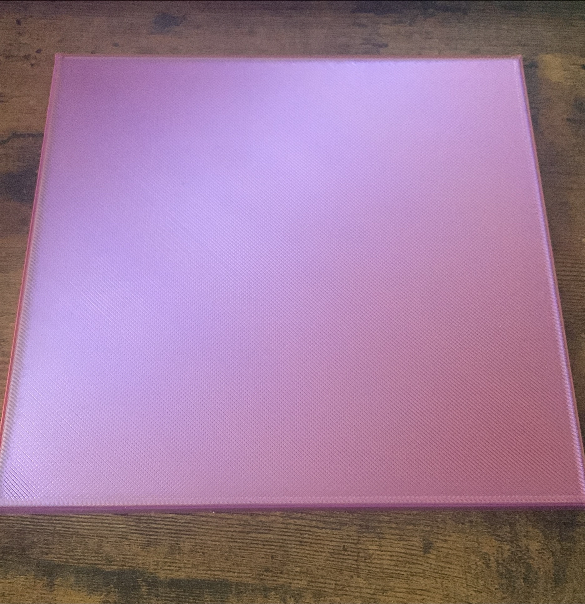

#  On est bien avancé !

## Camille

Cette semaine, j'ai continué à travailler sur le design des réseaux sociaux. J'ai aussi mis à jour notre maquette scénographique pour qu'elle soit à l'échelle et qu'elle ait des dimensions.

Nous avons parlé beaucoup en équipe cette semaine sur exactement comment nous voulons que notre installation soit, pour rendre le tout plus tangible. Nous avons aussi essayé notre projection avec le projecteur pour voir si le ratio et les dimensions sont correctes. 

J'ai aussi commencé à travailler sur le design de la projection.

## Dominik
Cette semaine, j'ai continué à travailler sur le prototype du projet pour le 7 novembre.

La base du jeu étant faite, j'ai commencé à travailler sur plusieurs points plus petits. Par exemple, afficher différents display sur différents écrans, ajouter le joueur 2 faire bouger les routes et ambulances selon la vitesse que le joueur gagne en effectuant le RCR ou encore la condition de victoire qui pour le moment, n'affiche qu'un panneau.

J'ai également fait un premier prototype de plaque pour pouvoir faire la manoeuvre dessus.

# Mario
## L'équipe de rally RCR vous attend

Le montage de la vidéo promotionnelle a bien avancé. Le montage en est à un stade acceptable, mais je crois qu'elle pourrait être améliorée, à part quelques défauts à corriger. Je vais prendre le reste de la semaine pour la finaliser et me laisser du temps libre pour corriger certains aspects que mon équipe aimerait apporter. Je suis assez fier de la vidéo elle représente le thème de notre projet et met en valeur l'ambiance de notre équipe.

## Lorie

Cette semaine, j'ai poursuivi mon travail sur le contenu des médias sociaux. De plus, j'ai entamé la création d'une animation de notre logo en vue de l'utiliser comme écran d'attente pour nos projections. 

J'ai disposé les éléments du logo créé par Camille sur différents calques en utilisant Illustrator. De plus, j'ai créé deux autres versions du cœur, une plus petite et une plus grande, en vue de les animer dans After Effects.

Enfin, j'ai complété l'animation du cœur, et il me reste simplement à animer la ligne de fréquence cardiaque.

