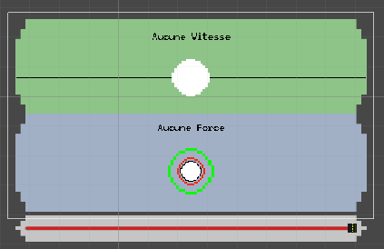

# Lentement mais sûrement
## Dominik

Cette semaine suite à la remise du sprint 2, j’ai continué à avancer sur le projet. J’ai commencé par intégré les images pour les panneaux et programé une barre de progression, incomplète pour le moment, pour donner une rétroaction directement au joueur. La prochaine étape sera de lier les parallaxes, de jouer les sons au bons moments et d’intégrer la totalité des images.

## Camille
## Lorie

# Rally RCR the movie the sequel !
## Mario

Les remises pour le sprint 02 ont été remis. Je suis satisfait de la premiere vidéo que j`ai montée et maintenant il faut en faire une deuxieme pour le sprint 03. Jai une idee de mise en scene qui va me demander de faire un peu de modelisation 3D, mais avant sa je vais aller chercher des nouvelles captures sur la progression de chaque membre de l'equipe. Ce montage sera plus oriente sur la progression de chaque memebre de lequipe et c est pour cette raison que je vais devoir attendre un semaine avant la fin de la remise pour avoir des captures sur la fin du projet.Je suis assez confiant que notre projet pour Chaos media va bien fonctionner.
 

## Samuel