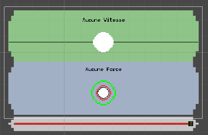
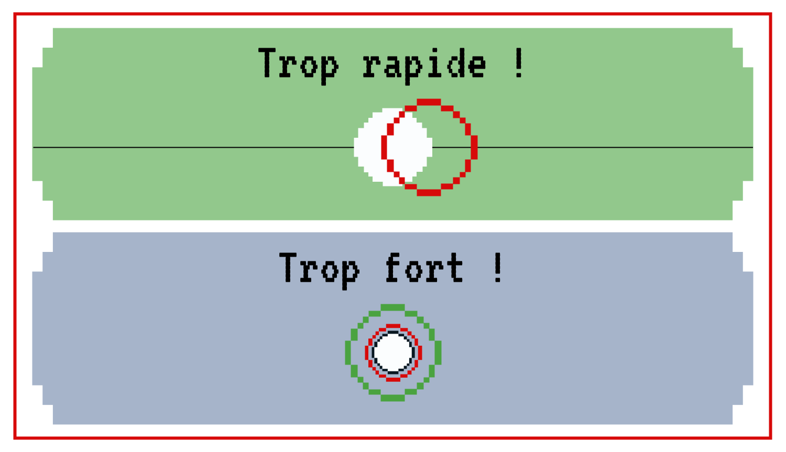
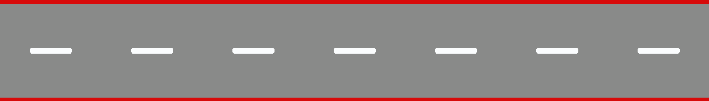
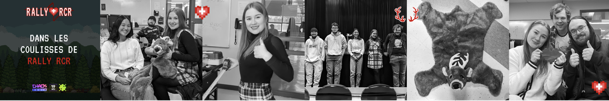
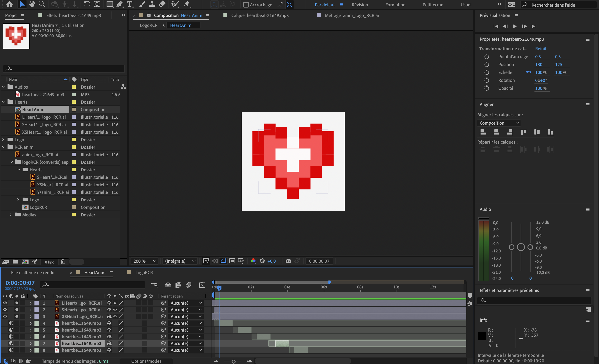
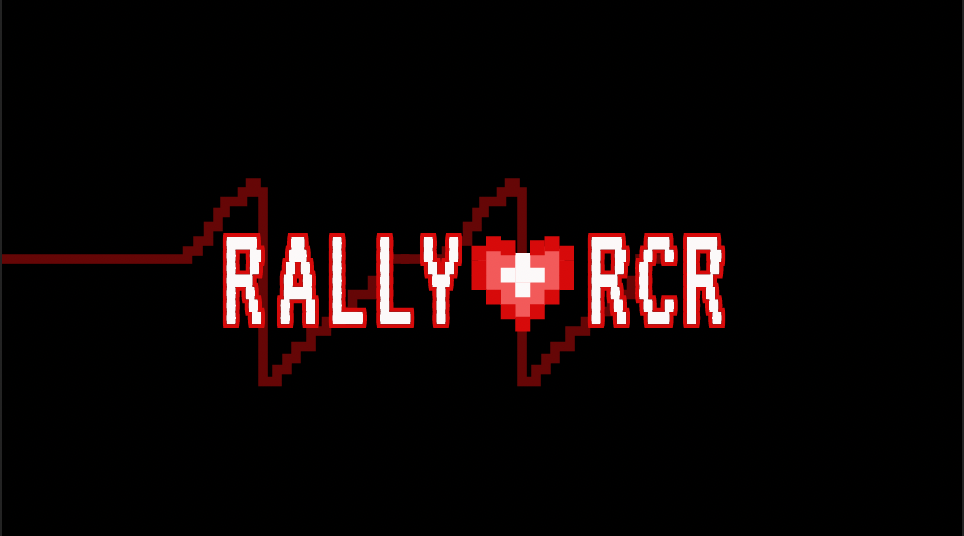

# LENTEMENT MAIS SÛREMENT!

## Dominik

Cette semaine, suite à la remise du sprint 2, j’ai continué à avancer sur le projet. J’ai commencé par intégrer les images pour les panneaux et programé une barre de progression, incomplète pour le moment, pour donner une rétroaction directement au joueur. La prochaine étape sera de lier les parallaxes, de jouer les sons au bons moments et d’intégrer la totalité des images.

## Camille

Cette semaine, nous avons reçu nos toutous et vérifié si tout était correct: c’était parfait! De mon côté, j’ai fait le design de l’interface au centre ainsi que le dessin de la route.

Pour les réseaux sociaux, j'ai fait le design pour la publication des "behind the scenes".

## Lorie

Pour la semaine 11, j'ai continué à développer le contenu des réseaux sociaux. De plus, j'ai amélioré l'animation du logo qui sera utilisé en tant qu'écran d'attente.

J'ai ajouté un effet sonore à chaque battement de cœur, et je crois avoir trouvé une façon d'animer la ligne de la fréquence cardiaque pour qu'elle change de position et répète son animation. Il me reste plus qu’à la faire jouer 5 fois. 

## Mario

Les remises pour le sprint 02 ont été remis. Je suis satisfait de la premiere vidéo que j`ai montée et maintenant il faut en faire une deuxieme pour le sprint 03. Jai une idee de mise en scene qui va me demander de faire un peu de modelisation 3D, mais avant ça, je vais aller chercher de nouvelles captures sur la progression de chaque membre de l'équipe. Ce montage sera plus orienté sur la progression de chaque membre de l'équipe et c'est pour cette raison que je vais devoir attendre une semaine avant la fin de la remise pour avoir des captures sur la fin du projet. Je suis assez confiant que notre projet pour Chaos media va bien fonctionner.
 

## Samuel

Cette semaine j'ai commencé à travailler sur le sprite de l'ambulance que nous allons mettre sur la route. Nous allons aussi l'utiliser pour signaler l'avancement du joueur au niveau de la route.

J'ai également terminé les derniers détails sur le parallaxe. Il est parfait.