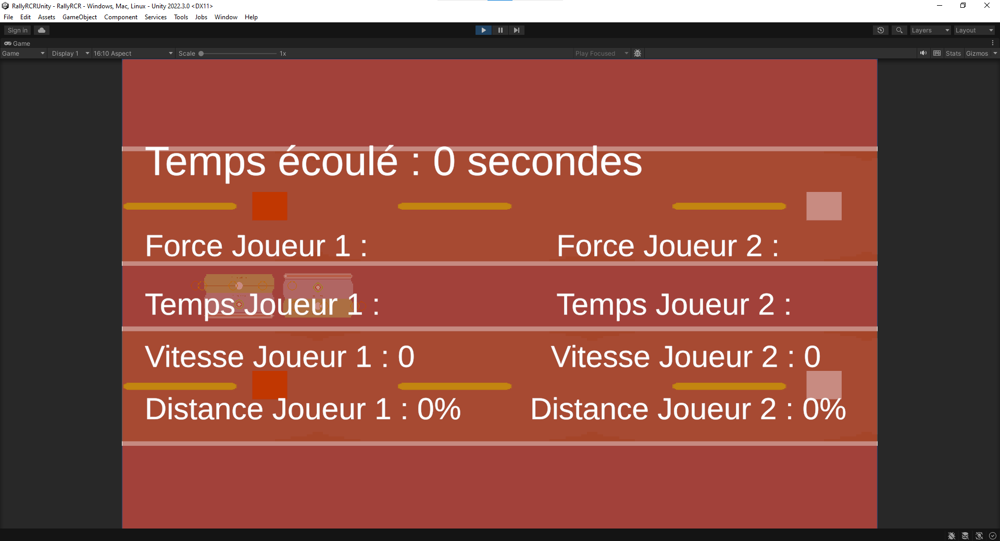
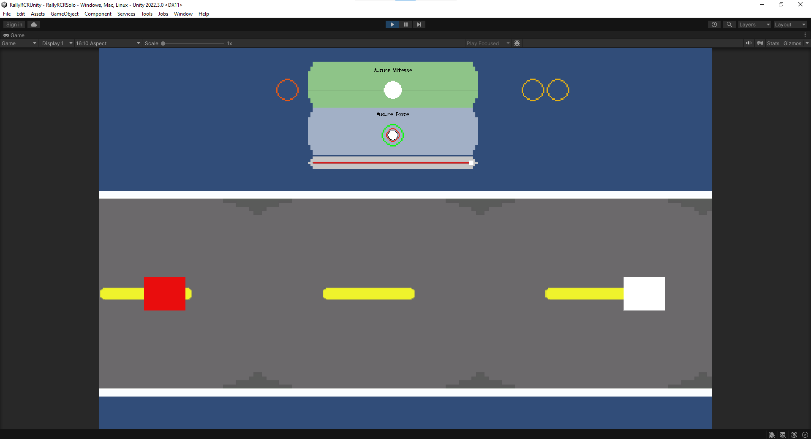
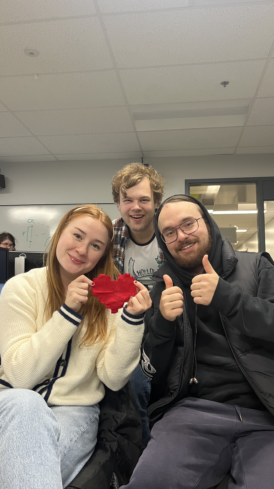
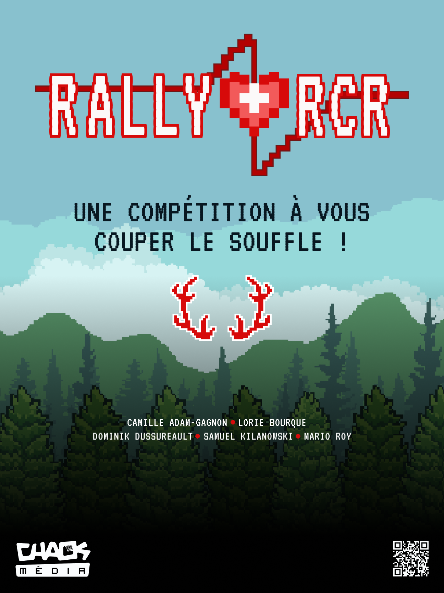
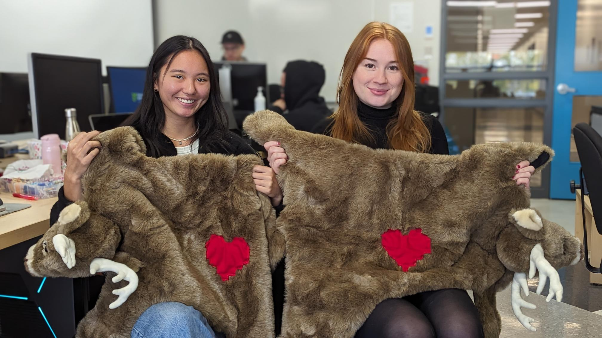

# Ça arrive! 

## Dominik
Cette semaine, j'ai continué à travaillé sur le projet. J'ai commencé par ajouter les sons pour les faire jouer aux bons moments. Les éléments principaux étant terminés, j'ai commencé à travailler sur des éléments plus secondaires. Par exemple, j'ai ajouté un mode solo au cas ou nous aurions un nombre impair de joueurs. J'ai également ajouté un mode debug.

## Camille

Cette semaine, j'ai acheté le tissu pour faire les coeurs sur les toutous, qui indiqueront aux joueurs à quel endroit placer leurs mains. J'ai coupé les coeurs, et Lorie et moi les avons cousu.

Aussi, j'ai fait le design de l'affiche, et je l'ai envoyé à l'imprimeur.

## Lorie

## Mario

## Samuel

