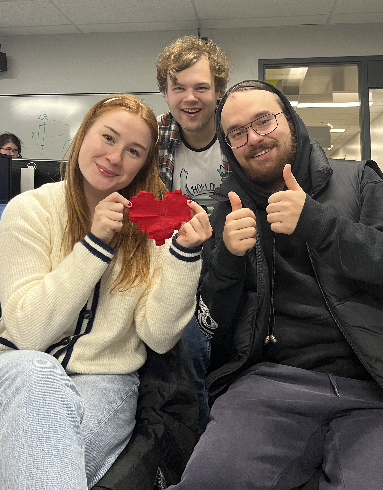

# CA ARRIVE! 

## Dominik

Cette semaine, j'ai continué à travailler sur le projet. J'ai commencé par ajouter les sons pour les faire jouer aux bons moments. Les éléments principaux étant terminés, j'ai commencé à travailler sur des éléments plus secondaires. Par exemple, j'ai ajouté un mode solo au cas où nous aurions un nombre impair de joueurs. J'ai également ajouté un mode debug.

## Camille

Cette semaine, j'ai acheté le tissu pour faire les coeurs sur les toutous, qui indiqueront aux joueurs à quel endroit placer leurs mains. J'ai coupé les coeurs, et Lorie et moi les avons cousus.

Aussi, j'ai fait le design de l'affiche, et je l'ai envoyé à l'imprimeur.

## Lorie

Pour la semaine 12, j'ai continué à élaborer du contenu pour les réseaux sociaux. J'ai également découpé et cousu le deuxième cœur, que Camille a ensuite fixé sur la peluche. Ces cœurs sont conçus pour servir d'indicateurs visuels lors des compressions appliquées aux chevreuils. Enfin, j'ai rédigé le contenu du texte qui sera affiché sur le site de ChaosMedia.

## Mario

J'ai décidé de prendre une petite pause dans le montage vidéo pour permettre aux autres de progresser sur leur partie du travail. Pendant ce temps, j'ai conçu une animation lorsque le joueur franchit la ligne d'arrivée. Il s'agit d'une petite animation qui affiche le mot "victoire" dans le style de notre installation.

## Samuel

Cette semaine, j'ai commencé le sprite de l'ambulance. Ce dernier servira pour la barre de progression du joueur, mais il sera aussi affiché sous le joueur pour lui indiqué qu'il est dans l'ambulance.

