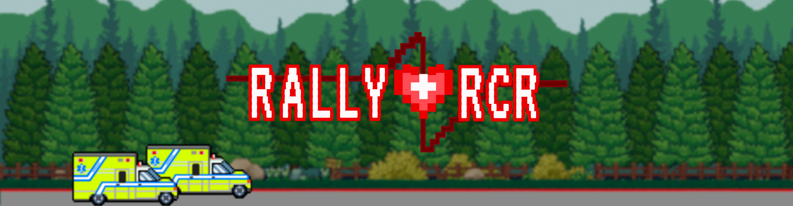
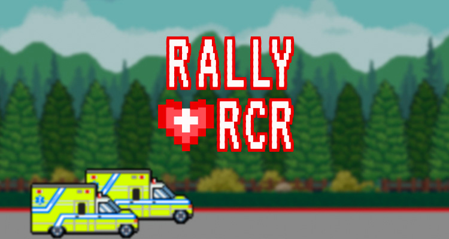
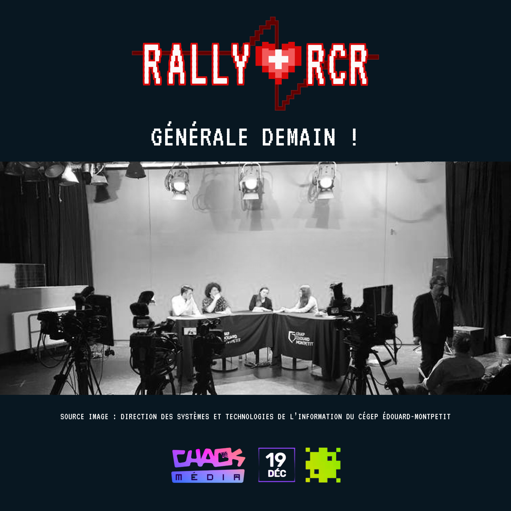
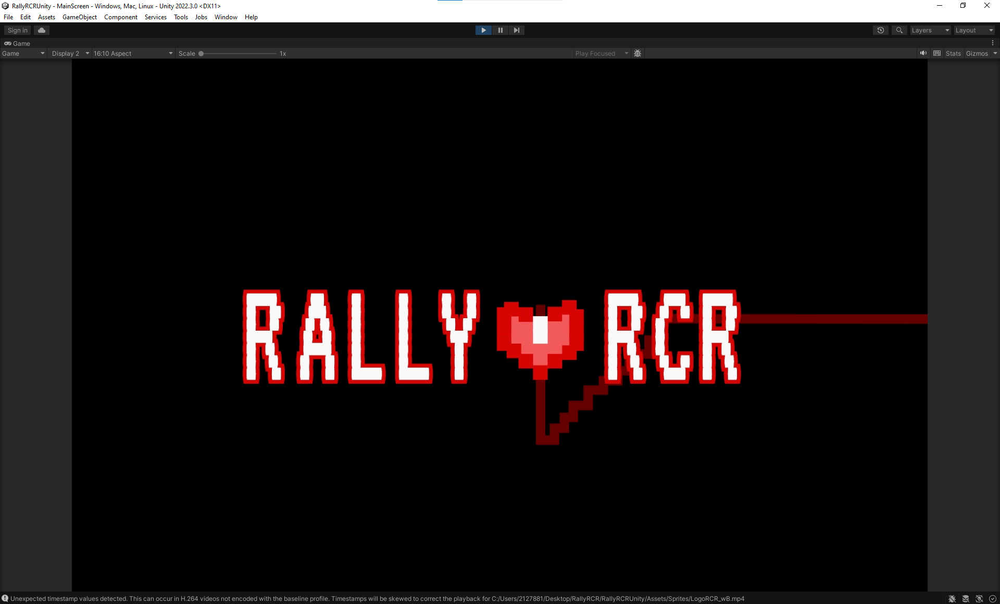
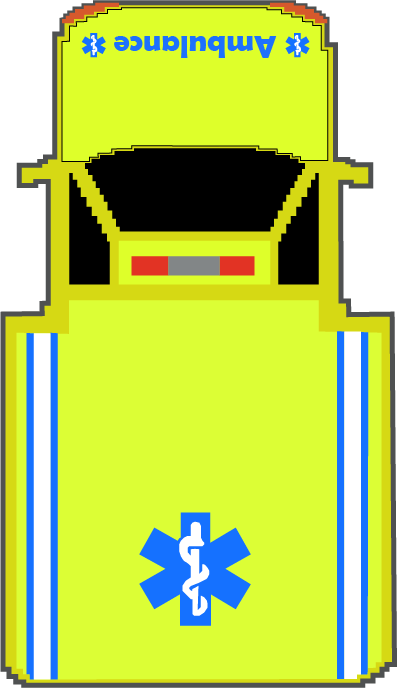

# Mario
## Retour sur la vidéo

J'ai terminé d'animer le texte de victoire, et maintenant je retourne travailler sur le montage. La vidéo que je prépare a pour objectif de présenter la progression de notre équipe dans ce projet. J'ai déjà récupéré une bonne partie des extraits vidéo dont j'avais besoin et commencé la base du montage. Je me donne jusqu'à samedi pour terminer d'assembler une première version à présenter à mon équipe. Cela devrait me laisser le temps d'ajouter du contenu lorsque mes coéquipiers auront terminé de finaliser leur partie du travail. Les tests utilisateurs de Chaos Media commencent la semaine prochaine, j'espère que nous aurons terminé d'ici là.

# Lorie

Pour la semaine 13, j'ai continué la rédaction du contenu pour les réseaux sociaux. De plus, j'ai finalisé l'animation de l'écran d'accueil en adoptant une approche différente de celle initiale. De plus, j'ai achevé le design des deux bannières qui seront affichées sur le site de ChaosMedia pour le système de vote.

# Camille
 
Cette semaine, nous sommes en semaine de relâche alors nous avons tous travaillé de chez nous. De mon côté, je suis allée chercher notre affiche chez notre imprimeur. Je suis aussi allée chez Michael's pour acheter notre foamcore, et pour regarder des idées de décorations. Notre affiche est donc officiellement terminée !
 
J'ai aussi créé le design des publications de la semaine. Finalement, pour le cours d'Assurance Qualité, j'ai aussi fait une liste de matériels dont nous aurons besoin à la générale et au ChaosMédia si jamais nous avons à réparer des parties de notre installation.
 

# Dominik
 
Cette semaine, étant donné que la générale approche, la plupart des changements que j'ai apportés sont des changements mineurs. J'ai, par exemple, ajouté les nouveaux sprites pour l'ambulance. J'ai aussi ajouté la vidéo d'attente de joueurs ainsi que des retouches dans certains scripts du jeu. 

# Samuel

Cette semaine, j'ai terminé le dernier sprite pour l'ambulance. Peut-être que des changements mineurs seront à prévoir sur l'illustration en fonction de comment elle rend à la générale

