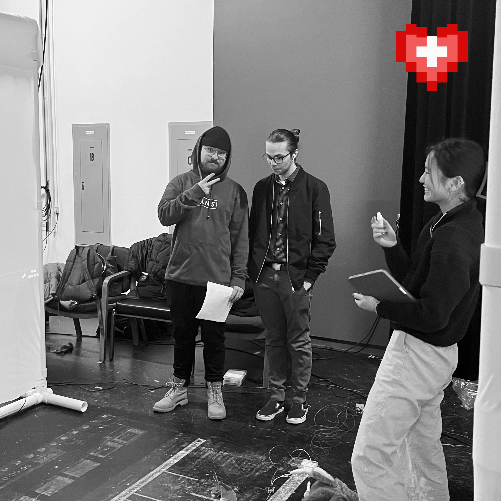

## LA VIDÉO EST FINIE!

# Mario

La deuxième vidéo pour Chaos Media est terminée. J'ai passé la semaine à récupérer les derniers rushes, à faire le montage et à créer des petites animations. Je suis satisfait de ce que j'ai réussi à faire. Malheureusement, environ 24 heures avant la remise, je me suis rendu compte que j'avais mis trop de contenu. En effet, la vidéo devait durer 1 minute et 30 secondes, mais je ne m'en étais pas rendu compte, donc j'ai dû raccourcir mon montage. J'ai quand même gardé la version longue de 3 minutes que je trouve plus aboutie.

# Camille

Cette semaine, nous avons eu une discussion toute la classe sur la Générale. Ensuite, notre équipe a eu une réunion sur ce que nous avons à faire d'ici le jour J. Nous avons donc tout mis à jour sur Trello.

Pour les réseaux sociaux, j'ai créé le design des publications de la semaine. J'ai créé un carousel qui inclut des montages vidéos et des photos de la Générale. J'ai aussi fait un carousel expliquant ce qu'il nous reste à faire et à améliorer d'ici ChaosMédia.

 

# Lorie

Pour la semaine 14, j'ai poursuivie la rédaction du contenu pour les réseaux sociaux. Nous avons eu notre répétition générale le 29 novembre, ce qui nous a permis d'obtenir des retours divers des utilisateurs internes et externes du cours. Suite à cela, nous avons discuté des éléments à corriger et pris des décisions concernant le confort des utilisateurs, ainsi que la projection sur les toiles latérales.

