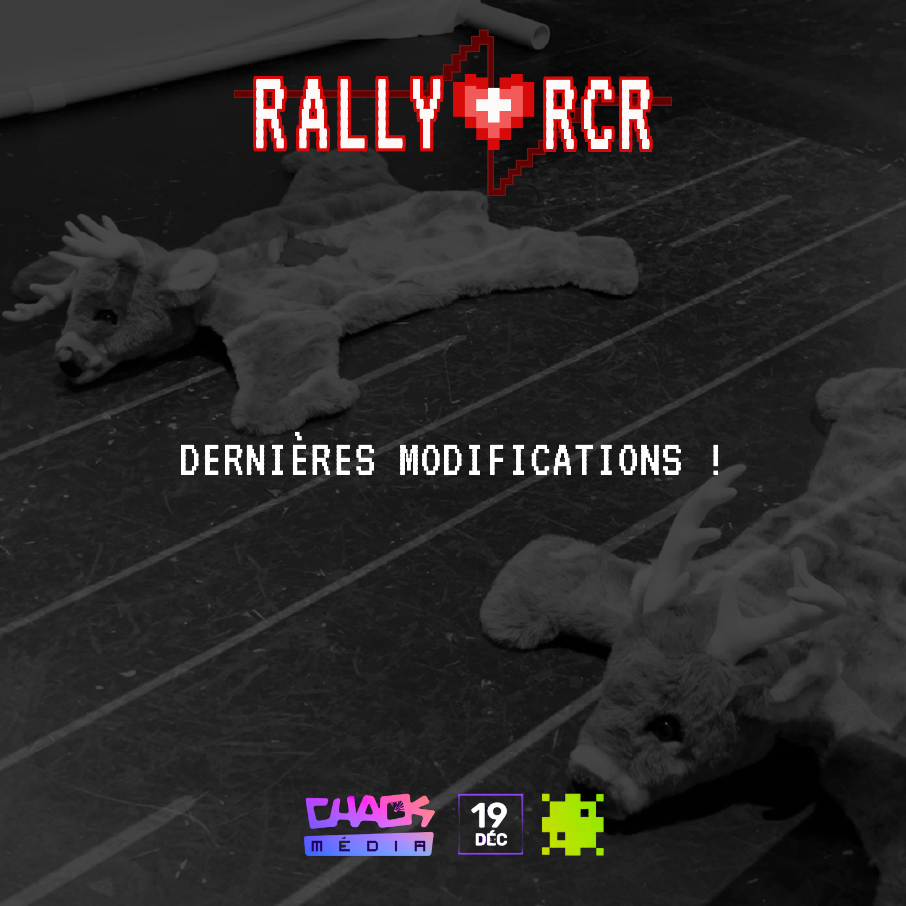

# Mario
## Retour sur les tests utilisateurs

Une démo de notre installation a eu lieu au studio TV. Nous avons pu tester notre jeu et nous sommes rendu compte que certains aspects nécessitaient des corrections avant Chaos Media. Malgré cela, nous étions heureux de l'enthousiasme des participants venus tester notre installation, et j'ai hâte d'être au 19 décembre pour Chaos Media.

# Camille

Cette semaine, nous avons travaillé sur le Sprint 4 et sur les dernières modifications à faire avant le jour J!

J'ai été en charge d'acheter nos derniers produits, comme le tapis de gazon et le ruban adhésif blanc.

Pour les réseaux sociaux, Lorie et moi avons travaillé sur les publications de la semaine, ainsi que la publication du jour de ChaosMédia.

--

Aujourd’hui est le jour J!

Nous avons commencé à installer Rally RCR vers 9:30. Nous avons eu des difficultés au début, parce que le projecteur au plafond devait être placé de façon différente que lors de la Générale, alors nous n’avions pas prévu les distances correctement. Mais lorsque le projecteur était bien placé, nous avons construit nos murs, placé le tapis blancs, les peluches et les Arduinos. Nous avons eu quelques bugs au début, comme un des capteurs qui était moins sensible que l’autre, mais nous avons réparé l’erreur. 

Lorsque le public est arrivé,

# Lorie

Le grand jour est enfin là ! Nous sommes arrivés le matin, vers environ 8h45, pour récupérer notre station d'ordinateur et tous les éléments nécessaires à notre installation. Avec une quantité importante d'équipement, deux chariots étaient à notre disposition. Le processus a duré environ 5 heures. Dans l'ensemble, tout s'est bien déroulé ; le seul hic a été l'installation du projecteur au plafond, car il n'était pas à la bonne place lors de la première tentative. La soirée s'est déroulée très agréablement, avec quelques ajustements parfois nécessaires sur les capteurs, mais dans l'ensemble, tout était parfait ! Nous sommes extrêmement satisfaits du résultat et ravis d'avoir remporté le coup de cœur des professeurs!

