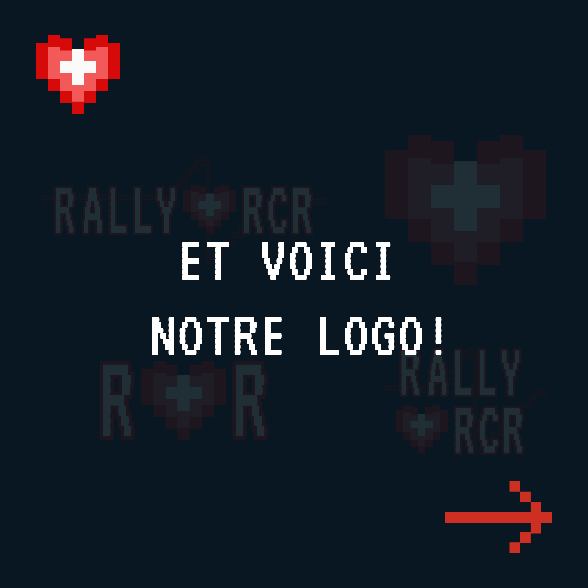
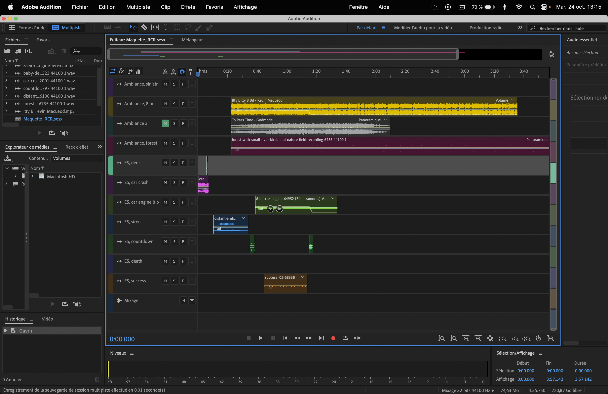
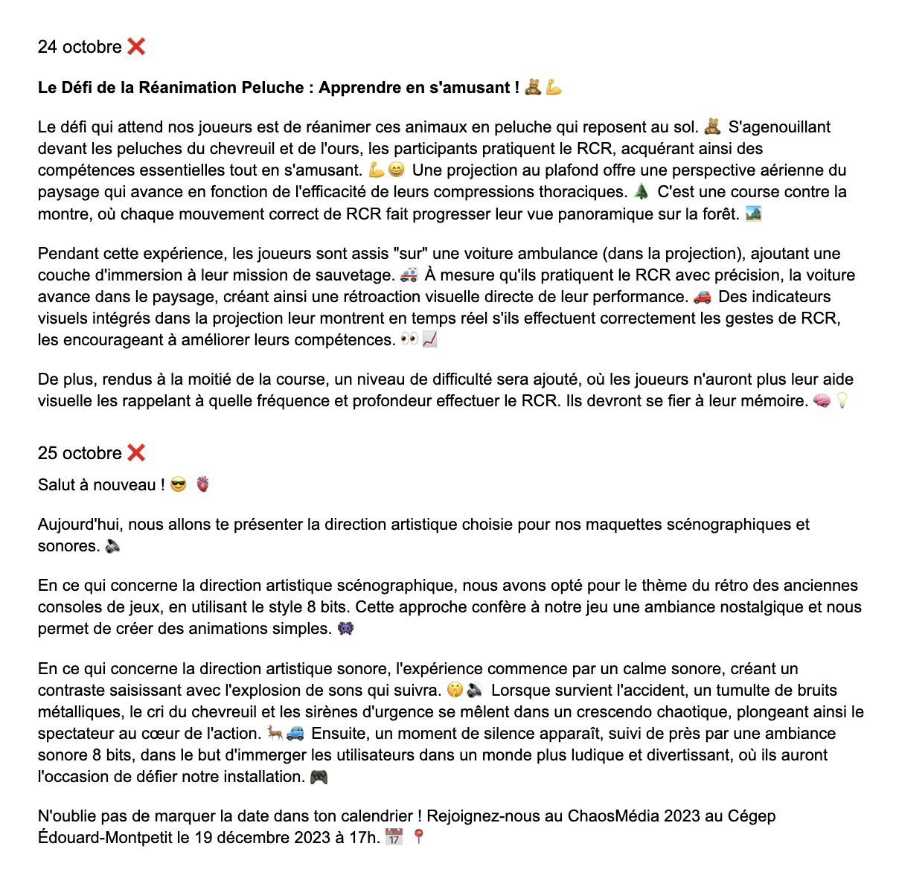
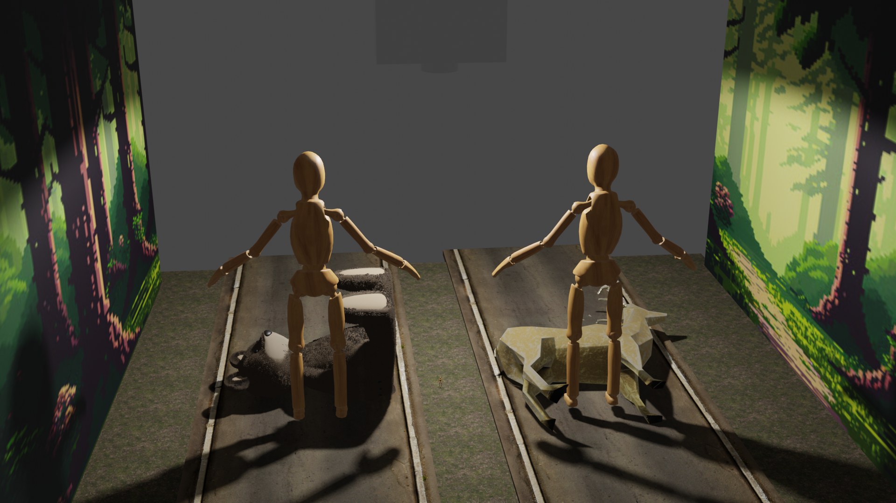

#  C'EST PARTI !
## Dominik
 Pour la semaine 8, j'ai terminé la démo de faisabilité avec le Arduino et TouchDesigner. J'ai ensuite lié Touch avec Unity et programmé un timer et la force pour pouvoir éventuellement déterminer si la vitesse et la force sont bonnes.

## Mario
 Le jeu Rally Rcr vient de terminer **son premier sprint.** Les éléments suivants ont été ajoutés au devis :

- Les maquettes,
- Les démos techniques,
- Les démos sonores,
- Les chartes graphiques,
- Le logo

Suite à des critiques qui nous ont été données, nous avons eu des problèmes à choisir entre une installation sérieuse ou ludique. Finalement, nous sommes parvenues à nous accorder sur une direction plus ludique.

Nous avons donc effectué quelques changements dans notre projet, comme l'intégration de deux peluches d'animaux plutôt que deux mannequins.

Nous avons également choisi d'intégrer notre interface de jeu au sol grâce à une projection. La projection consiste en une route qui se déplace sur un effet parallaxe.

En résumé, nous sommes parvenus à progresser rapidement et chaque membre de l'équipe a bien contribué.

Maintenant, pour les défis qui nous attendent, nous devons entamer le deuxième sprint et donc commencer la création des réseaux sociaux et continuer la progression de notre installation.

## Camille

Cette semaine, pour le Sprint 1, j'ai mis en page et créé le devis. J'ai aussi réalisé la charte graphique.

De plus, Lorie et moi avons créé les comptes des réseaux sociaux. J’ai créé un calendrier pour nous aider à planifier nos publications car elle et moi s'occuperont des réseaux.

J’ai créé le design de notre première publication introduisant notre logo et invitant les gens à venir à notre installation lors du ChaosMédia.

J’ai aussi développé le design d’un carrousel qui sera notre deuxième publication. Elle expliquera en détail au public notre direction artistique pour notre installation.

## Lorie 

Lorie : Pour la semaine 8, j'ai réalisé le mixage de la maquette sonore. Tous les sons et effets sonores ont été récupérés sur des sites libres de droits. 

De plus, Camille et moi avons commencé à élaborer du contenu pour les réseaux sociaux, afin de faciliter la planification de nos publications à l'avance.

## Samuel

À la semaine 8, j'ai fait une maquette sommaire de la scène que nous allons créé. Nous allons mettre des toiles sur les côtés pour donner une ambiance. J'ai définis aussi l'emplacement des personnes qui joueront à notre jeu.

