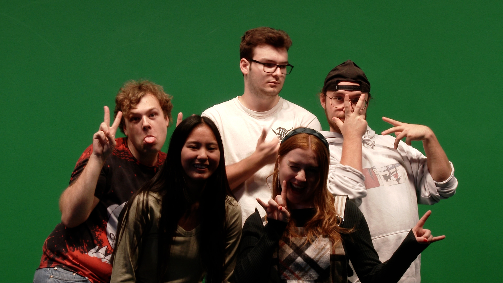

#  ÇA AVANCE !

## Camille

Cette semaine, Lorie et moi avons travaillé ensemble pour préparer plusieures futures publications de Facebook et Instagram. J'ai développé le design, alors qu'elle a écrit les textes.

En détail, j'ai créé les publications sur: modalités d'interaction, notre équipe, maquette sonore et à propos du ChaosMédia.

Voici tous les créatifs que j'ait crées cette semaine:

#  Silence sa tourne !

## Mario

"Cette semaine, notre équipe s'est rendue au studio TV pour filmer des plans de présentation pour le making-of.

J'avais réservé le studio TV et l'équipement. Le tournage s'est relativement bien passé, mais j'ai eu une petite frayeur vers la fin car je ne trouvais pas les scènes que nous avions filmées. Après un certain stress, nous avons finalement récupéré les séquences.

Le montage pour le segment de la capsule vidéo a commencé. J'espère ne pas rencontrer trop de difficultés de ce côté... Oh non Camille et Lori porte du vert, s'est mal partit 😅."

