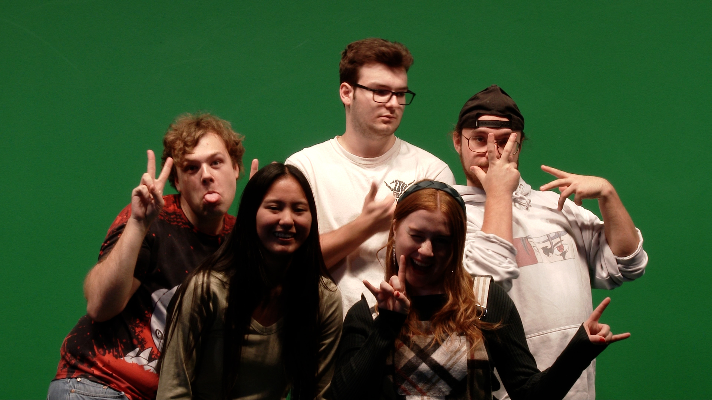
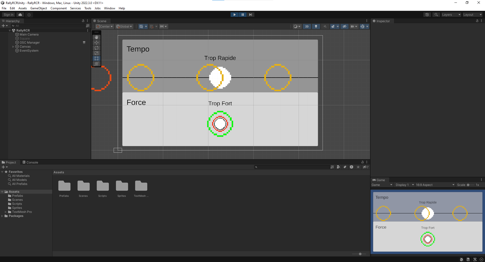
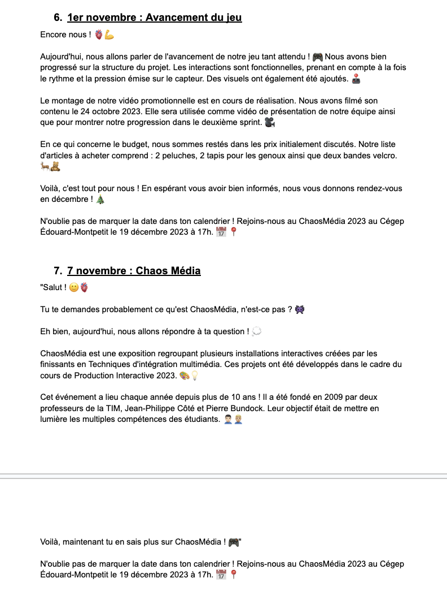
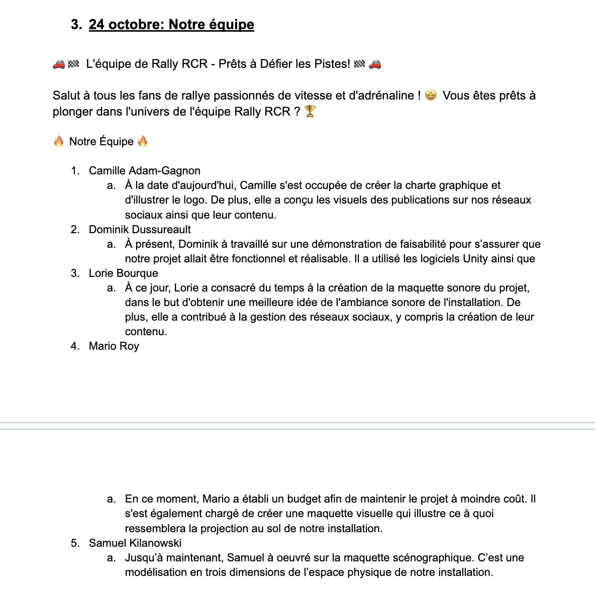
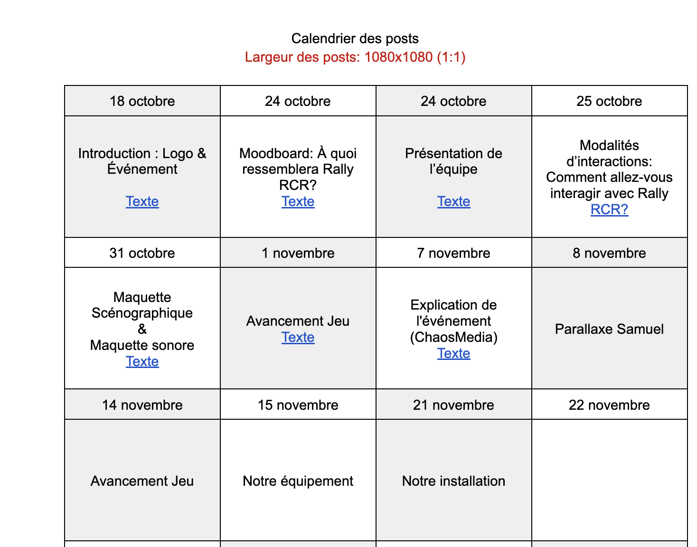
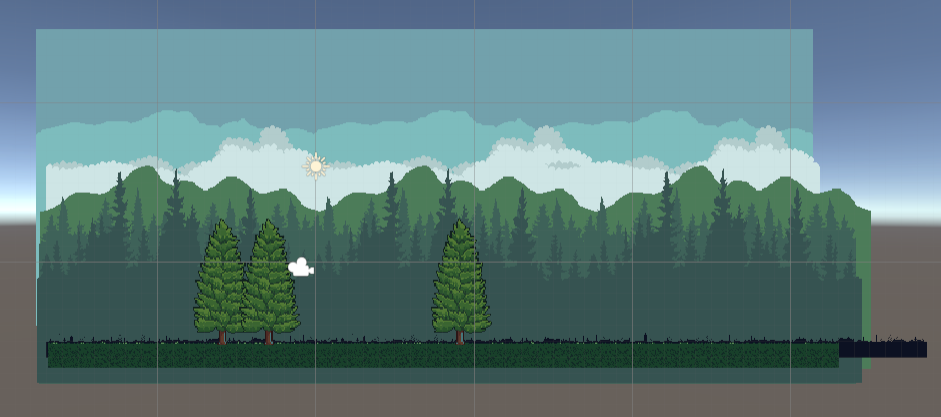

#  ÇA AVANCE !

## Camille

Cette semaine, Lorie et moi avons travaillé ensemble pour préparer plusieures futures publications de Facebook et Instagram. J'ai développé le design, alors qu'elle a écrit les textes.

En détail, j'ai créé les publications sur: modalités d'interaction, notre équipe, maquette sonore et à propos du ChaosMédia.

Voici tous les créatifs que j'ait crées cette semaine:

#  Silence sa tourne !

## Mario

"Cette semaine, notre équipe s'est rendue au studio TV pour filmer des plans de présentation pour le making-of.

J'avais réservé le studio TV et l'équipement. Le tournage s'est relativement bien passé, mais j'ai eu une petite frayeur vers la fin car je ne trouvais pas les scènes que nous avions filmées. Après un certain stress, nous avons finalement récupéré les séquences.

Le montage pour le segment de la capsule vidéo a commencé. J'espère ne pas rencontrer trop de difficultés de ce côté... Oh non Camille et Lori porte du vert, s'est mal partit 😅."

## Dominik

Cette semaine, j'ai continuer l'avancement dans Unity pour faire le prototype fonctionel du projet à remettre pour le sprint 2. J'avais prévu initialement un simple 4h pour programmer les interactions et rétroaction selon le rythme et la force. Mais m'étant compliqué grandement la vie, le temps finale de cette tâche fut plutôt 8h. Mais au final, j'ai un début de prototype fonctionel. La prochaine étape serait d'ajouter le deuxième joueur et intégrer les images et sons finaux.

## Lorie 

Cette semaine, Camille et moi avons poursuivi la création de contenu pour nos publications sur les réseaux sociaux. J'ai rédigé les textes des publications concernant notre équipe, l'avancement du jeu (qui sera publié le 1er novembre) et ChaosMédia (qui sera publié le 7 novembre).

J'ai également continué à réfléchir aux contenus des semaines à venir afin de planifier nos publications à l'avance.

## Samuel

Cette semaine, j'ai avancé la version finale du parallaxe qui sera sur les côtés, derrières les joueurs. Les deux parallaxes sont presque terminé, il faut juste que je rajoutes les détails au premier plan. Je vais commencer la route également la semaine prochaine.

